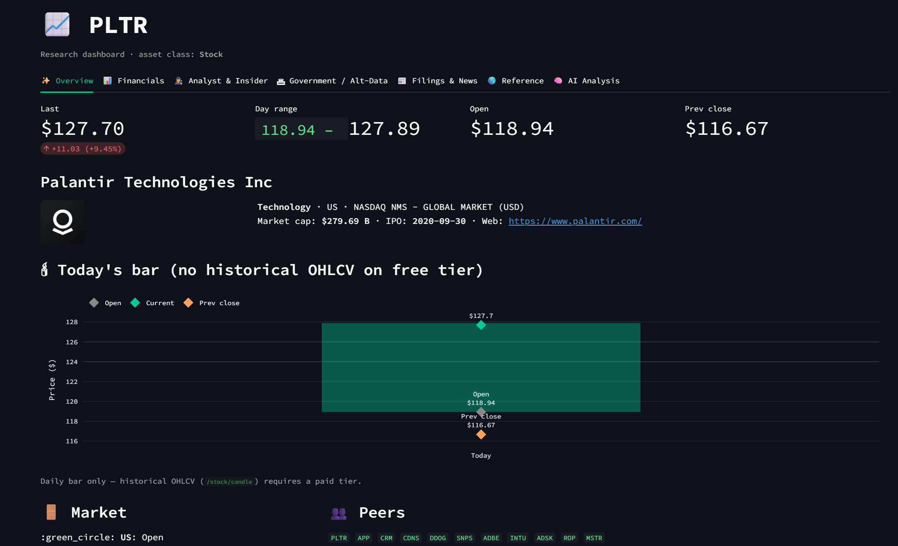
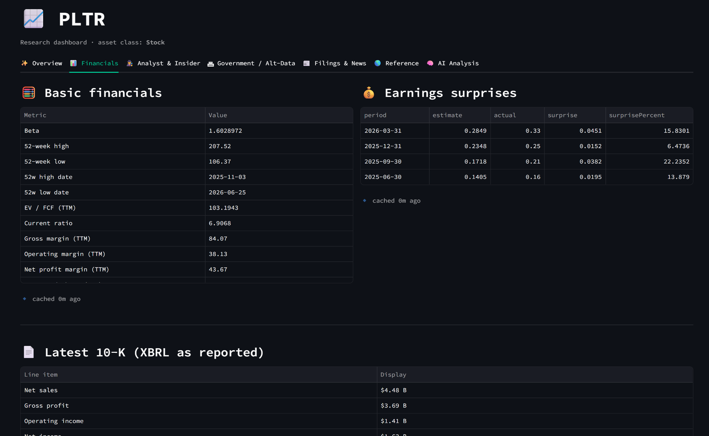
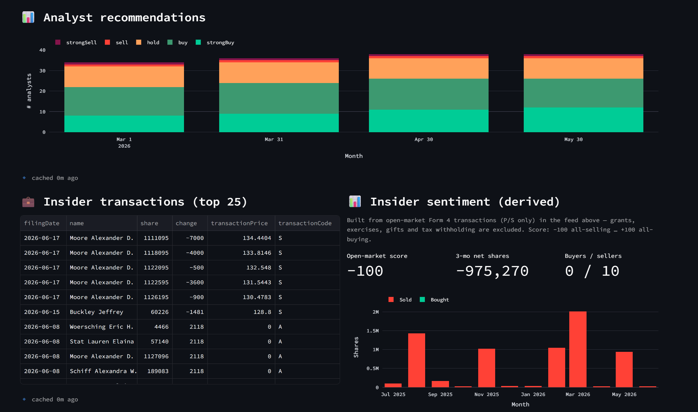
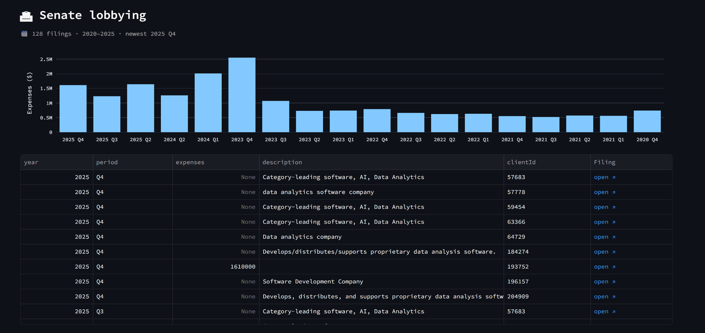
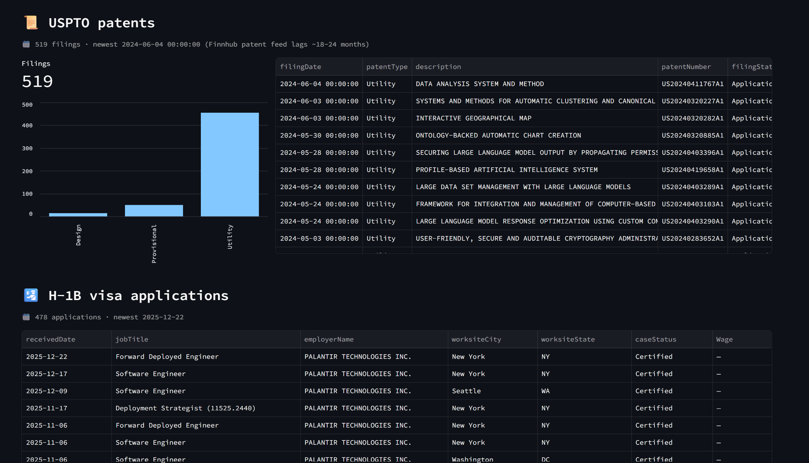
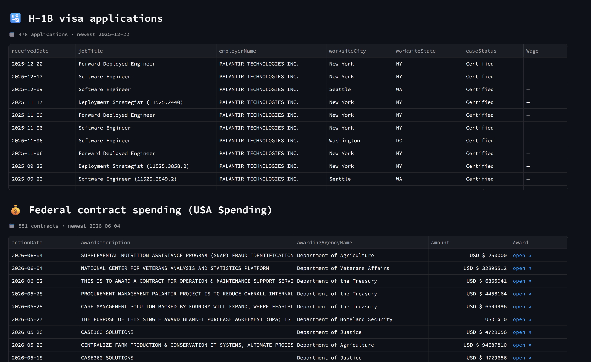
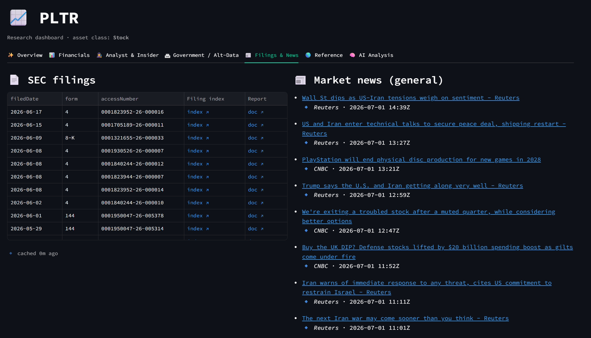
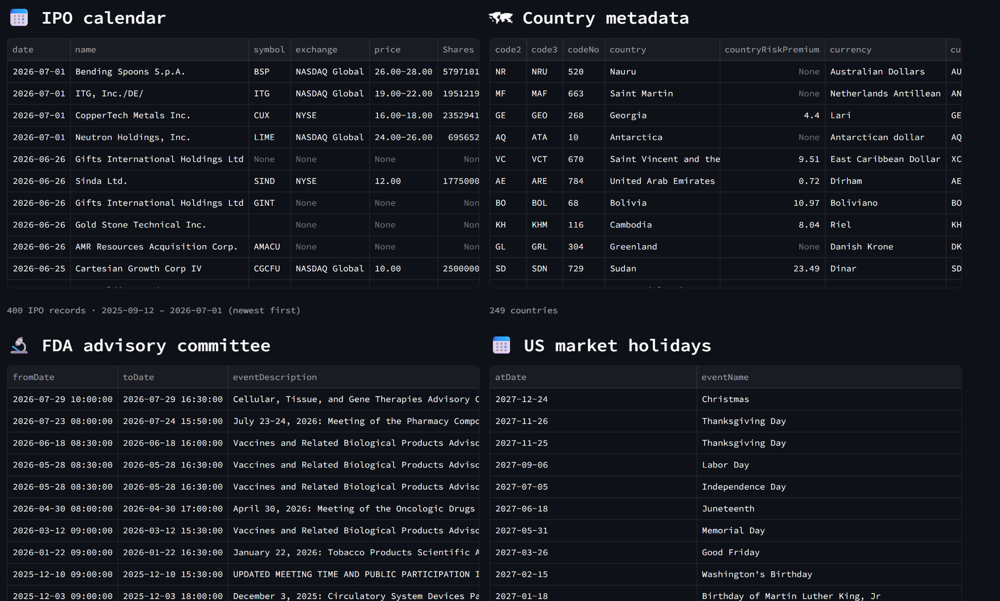
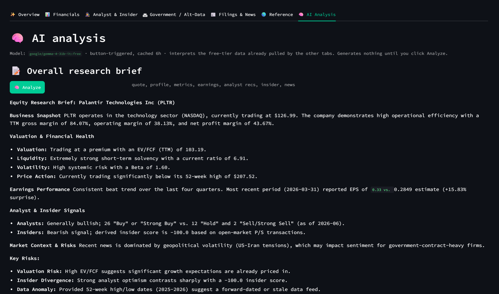

# Finnhub Research Dashboard

A local Streamlit research dashboard built entirely on the **Finnhub free tier** — no paid subscription required. Type any ticker and get a 7-tab deep-dive assembled from the 27 endpoints the free key can reach.

---

## Screenshots

### Overview — Quote, Profile & Daily Bar


### Financials — Metrics, Earnings Surprises & 10-K XBRL


### Analyst & Insider — Recommendations, Transactions & Sentiment


### Government / Alt-Data — Senate Lobbying


### Government / Alt-Data — USPTO Patents & H-1B Visa Applications


### Government / Alt-Data — H-1B (continued) & Federal Contract Spending


### Filings & News — SEC Filings & Market Headlines


### Reference — IPO Calendar, Country Metadata, FDA Calendar & Market Holidays


### AI Analysis — LLM Research Brief


---

## Features

| Tab | Data shown |
|---|---|
| **Overview** | Live quote card, company profile, peers, market status, daily OHLC bar |
| **Financials** | 133-metric ratio table, quarterly EPS surprises, latest 10-K XBRL summary |
| **Analyst & Insider** | 6-month recommendation trend, top-25 insider transactions, open-market sentiment score |
| **Government / Alt-Data** | Senate lobbying spend, USPTO patents, H-1B visa applications, federal contract awards |
| **Filings & News** | SEC filing index (with links), top-20 market headlines |
| **Reference** | IPO calendar, FDA advisory calendar, US market holidays, country metadata, crypto/forex exchange lists |
| **AI Analysis** | Button-triggered LLM briefs (overall, financials, alt-data, insider) via OpenRouter — cached 6 h |

**Free-tier only** — all 27 endpoints that return real data on a `$0` Finnhub account. The 87 paid-tier endpoints (historical OHLCV, estimates, social sentiment, institutional ownership, etc.) are explicitly excluded.

---

## Quick Start

### 1. Clone & install

```bash
git clone https://github.com/The-Options-Guru/finhub-data.git
cd finhub-data
pip install -r dashboard/requirements.txt
```

### 2. Add your API key

Create a `.env` file in the repo root (copy from `.env.example`):

```
FINNHUB_API_KEY=your_key_here

# Optional — for the AI Analysis tab
OPENROUTER_API_KEY=your_openrouter_key_here
OPENROUTER_MODEL=meta-llama/llama-3.3-70b-instruct:free
```

Get a free Finnhub key at <https://finnhub.io>.

### 3. Run the dashboard

```bash
cd dashboard
streamlit run app.py
```

Browser opens at <http://localhost:8501>. Type any US ticker in the sidebar and press Enter.

---

## Project Layout

```
finhub-data/
├── .env.example              # Key template (real key is gitignored)
├── finnhub_free.py           # CLI script — exercises all 27 free endpoints
├── probe_endpoints.py        # Auto-probes the full Swagger spec (114 endpoints)
├── images/                   # Dashboard screenshots
└── dashboard/
    ├── app.py                # Streamlit UI — sidebar + 7 tabs
    ├── finnhub_client.py     # Typed per-endpoint functions (never raise)
    ├── cache.py              # SQLite TTL cache at .cache/finnhub.db
    ├── ai_client.py          # OpenRouter LLM integration
    ├── requirements.txt      # streamlit, requests, plotly
    └── .streamlit/
        └── config.toml       # Dark theme + server config
```

---

## CLI Scripts

### `finnhub_free.py` — endpoint exerciser

```bash
python finnhub_free.py              # run all 27 endpoints, print summary
python finnhub_free.py quote        # single endpoint
python finnhub_free.py --list       # print the 27 working paths
python finnhub_free.py --json       # dump all responses to JSON
```

### `probe_endpoints.py` — full Swagger probe

Hits every one of the 114 documented endpoints and buckets each as `ok / empty / forbidden / other`. Run after any plan change to verify free-tier coverage.

```bash
python probe_endpoints.py
```

---

## Caching

Responses are cached in `dashboard/.cache/finnhub.db` (SQLite) to stay under the 60 req/min free-tier rate limit.

| Endpoint family | TTL |
|---|---|
| `/quote` | 60 s |
| `/news`, market status | 5 min |
| All other per-symbol | 1 hour |
| Reference data (country, COVID, FDA, IPO, exchanges) | 24 hours |
| AI analysis | 6 hours |

To wipe: delete `dashboard/.cache/finnhub.db` or click **Refresh this symbol** in the sidebar.

---

## AI Analysis

The AI tab calls [OpenRouter](https://openrouter.ai) with free `:free` models. The default is `meta-llama/llama-3.3-70b-instruct:free`. If that model 429s at peak, it falls back through:

1. `nvidia/nemotron-3-super-120b-a12b:free`
2. `openai/gpt-oss-120b:free`
3. `qwen/qwen3-next-80b-a3b-instruct:free`

No OpenRouter key = AI tab is silently disabled; all other tabs work normally.

---

## Free vs Paid Endpoints

The free tier gives access to **27 of 114** Finnhub endpoints. Key gaps:

| Blocked (403) | Workaround used |
|---|---|
| Historical OHLCV (`/stock/candle`) | Daily bar from `/quote` (open, current, prev close, range) |
| Simplified statements (`/stock/financials`) | Raw XBRL via `/stock/financials-reported` |
| Price targets, upgrade/downgrade summaries | Analyst consensus from `/stock/recommendation` |
| Social/news sentiment | Open-market insider sentiment from `/stock/insider-sentiment` |

---

## License

MIT
